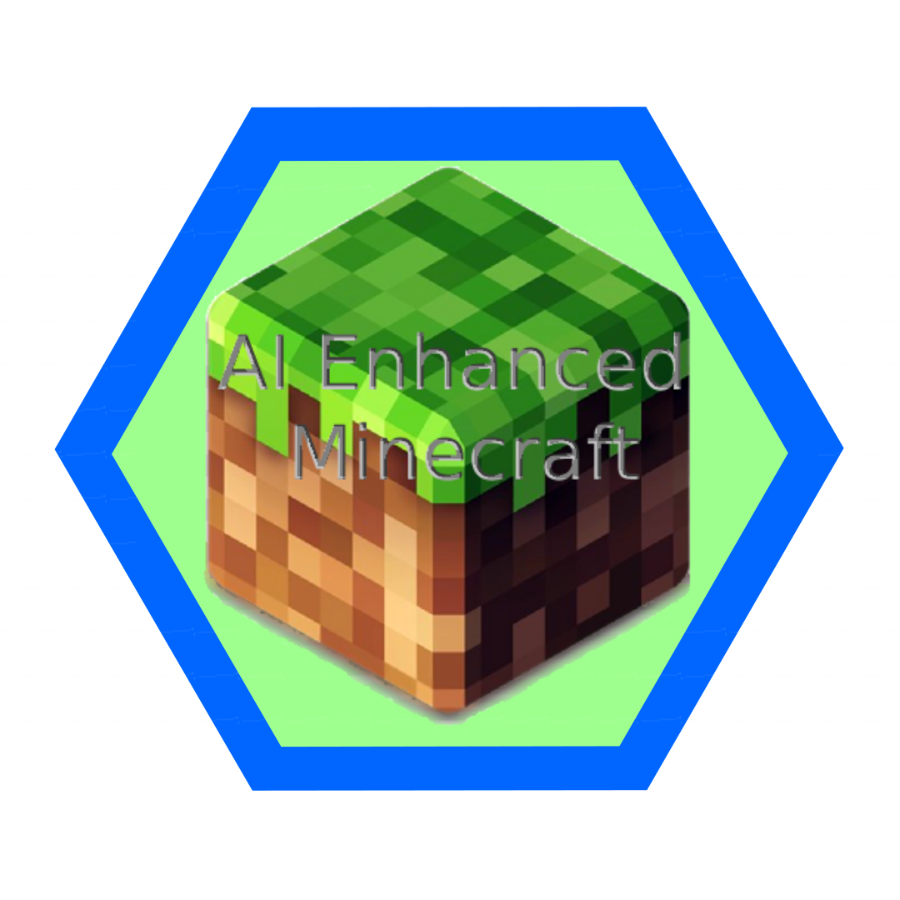

<a name="readme-top"></a>

[![Contributors][contributors-shield]][contributors-url]
[![Forks][forks-shield]][forks-url]
[![Stargazers][stars-shield]][stars-url]
[![Issues][issues-shield]][issues-url]
[![MIT License][license-shield]][license-url]

<h1 align="center">
  <br>
  <a href="https://github.com/andrefdre/AI-Enhanced-Minecraft"></a>
  <br>
    AI-Enhanced-Minecraft
  <br>
</h1>
  <p align="center">
    An AI-driven player controller for Minecraft built on top of <a href="https://www.ros.org/" target="_blank">ROS2</a> and <a href="https://pytorch.org/" target="_blank">Pytorch</a>.
    <br />
    <a href="https://github.com/andrefdre/Dora_the_mug_finder_SAVI/wiki"><strong>Explore the Wiki »</strong></a>
    <br />
    <br />
    <a href="https://youtu.be/vULnTanHHmM">View Demo</a>
    ·
    <a href="https://github.com/andrefdre/Dora_the_mug_finder_SAVI/issues">Report Bug</a>
    ·
    <a href="https://github.com/andrefdre/Dora_the_mug_finder_SAVI/issues">Request Feature</a>
  </p>

<!--  -->

<!-- TABLE OF CONTENTS -->
<details>
  <summary>Table of Contents</summary>
  <ol>
    <li>
      <a href="#key-features">Key Features</a>
    </li>
    <li>
      <a href="#how-to-use">How to use</a>
    </li>
    <li><a href="#contributing">Contributing</a></li>
    <li><a href="#license">License</a></li>
    <li><a href="#contact">Contact</a></li>
  </ol>
</details>

## Key Features

- AI Integration: Harness the power of AI to control player actions in Minecraft.
- Autonomous Gameplay: Experience intelligent and adaptive in-game behaviors driven by advanced algorithms.
- Training Framework: Train the AI model using reinforcement learning techniques for improved performance (Future Work).
<!-- - Minecraft API Integration: Communicate with the Minecraft API to interact with the game environment. -->
- Documentation: Extensive documentation and tutorials to assist with implementation and usage.

<p align="right">(<a href="#readme-top">back to top</a>)</p>

## How To Use

TTo use this code, first add the next line in the bashrc or your shell configuration file:

  ```
#AI-Enhanced-Minecraft
export AI_ENHANCED_MINECRAFT=/home/andre/ai_enhanced_minecraft
export PYTHONPATH="$PYTHONPATH:${HOME}/ros2_ws/src/AI-Enhanced-Minecraft"
  ```
Replace the path to where all the datasets are stored in your computer. 

Afterward, update the shell with the new configuration using:
```
source ~/.bashrc
```
If you use zsh, just change to *.zshrc*.

Inside ai_enhanced_minecraft folder, there should be a structure similar to:
  - models
  - datasets

<p align="right">(<a href="#readme-top">back to top</a>)</p>


<!-- CONTRIBUTING -->
## Contributing

If you have a suggestion that would make this better, please fork the repo and create a pull request. You can also simply open an issue with the tag "enhancement".
Don't forget to give the project a star! Thanks again!

1. Fork the Project
2. Create your Feature Branch (`git checkout -b feature/AmazingFeature`)
3. Commit your Changes (`git commit -m 'Add some AmazingFeature'`)
4. Push to the Branch (`git push origin feature/AmazingFeature`)
5. Open a Pull Request

<p align="right">(<a href="#readme-top">back to top</a>)</p>

<!-- LICENSE -->
## License

Distributed under the GPL License. See `LICENSE.txt` for more information.

<p align="right">(<a href="#readme-top">back to top</a>)</p>

<!-- CONTACT -->
## Contact

André Cardoso - andref@ua.pt

José Cação -

Project Link: [AI-Enchanced-Minecraft](https://github.com/andrefdre/AI-Enhanced-Minecraft)

<p align="right">(<a href="#readme-top">back to top</a>)</p>


<!-- MARKDOWN LINKS & IMAGES -->
<!-- https://www.markdownguide.org/basic-syntax/#reference-style-links -->
[contributors-shield]: https://img.shields.io/github/contributors/andrefdre/AI-Enhanced-Minecraft.svg?style=for-the-badge
[contributors-url]: https://github.com/andrefdre/AI-Enhanced-Minecraft/graphs/contributors
[forks-shield]: https://img.shields.io/github/forks/andrefdre/AI-Enhanced-Minecraft.svg?style=for-the-badge
[forks-url]: https://github.com/andrefdre/AI-Enhanced-Minecraft/network/members
[stars-shield]: https://img.shields.io/github/stars/andrefdre/AI-Enhanced-Minecraft.svg?style=for-the-badge
[stars-url]: https://github.com/andrefdre/AI-Enhanced-Minecraft/stargazers
[issues-shield]: https://img.shields.io/github/issues/andrefdre/AI-Enhanced-Minecraft.svg?style=for-the-badge
[issues-url]: https://github.com/andrefdre/AI-Enhanced-Minecraft/issues
[license-shield]: https://img.shields.io/github/license/andrefdre/AI-Enhanced-Minecraft.svg?style=for-the-badge
[license-url]: https://github.com/andrefdre/AI-Enhanced-Minecraft/blob/master/LICENSE.txt
[product-screenshot]: Docs/logo.svg